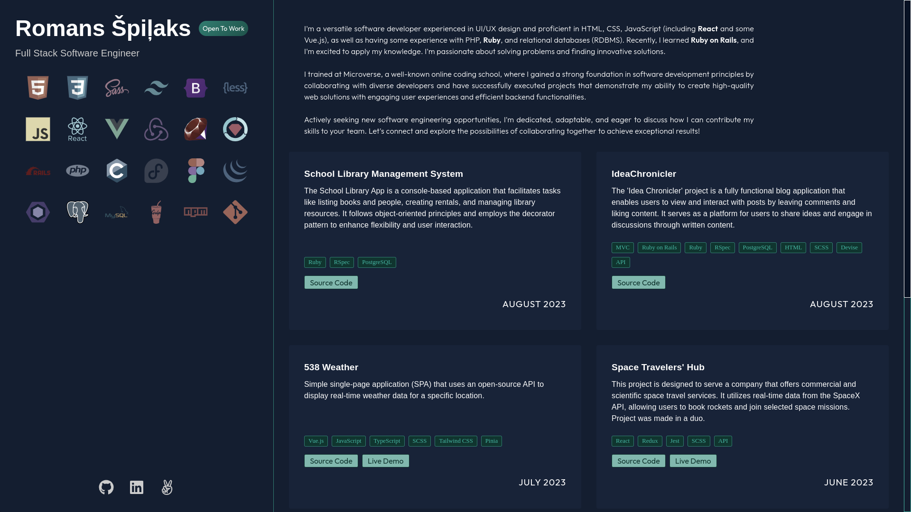

<!-- PROJECT DESCRIPTION -->

# <a name="about-project"> Portfolio </a>

The **"Portfolio"** project serves as a collection of details regarding the skills and tools that were utilized in past projects.

<!-- TABLE OF CONTENTS -->

## Table of Contents

- [Tech Stack](#tech-stack) 🛠️
- [Authors](#authors) 🖋️
- [Contributing](#contributing) 🤝
- [License](#license) 📄

<!-- TECH STACK -->

## Tech Stack 🛠️ 

  <ul>
     <li><a href="https://react.dev/">React</a></li>
     <li><a href="https://sass-lang.com/">SCSS</a></li>
     <li><a href="https://vitejs.dev/">Vite</a></li>
  </ul>

(<a href="#readme-top">back to top</a>)

<!-- AUTHORS -->

## 🖋️ Authors

  🧑‍🦲 **Romans Š.**

- GitHub: [@romans-adi](https://github.com/romans-adi/)
- Twitter: [@obj583](https://twitter.com/obj583/)
- LinkedIn: [Romans Špiļaks](https://www.linkedin.com/in/obj513/)

(<a href="#readme-top">back to top</a>)

<!-- CONTRIBUTING -->

## 🤝 Contributing 

I welcome contributions to enhance the functionality and user experience of the IdeaChronicler Application. If you have any ideas, suggestions, or bug reports, feel free to open an issue or submit a pull request. Let's share ideas!

If you'd like to contribute to this project, please follow these steps:

1. Fork the repository.
2. Create a new branch for your feature or bug fix.
3. Make your changes and commit them with descriptive commit messages.
4. Push your changes to your forked repository.
5. Submit a pull request to the main repository, explaining your changes in detail.

Please adhere to the coding conventions and guidelines specified in the project.

Feel free to check the [issues page](../../issues/).

(<a href="#readme-top">back to top</a>)

<!-- LICENSE -->

## 📄 License 

This project is [MIT](LICENSE) licensed.

(<a href="#readme-top">back to top</a>)

